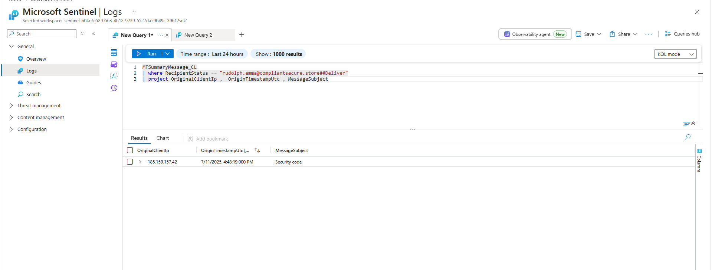
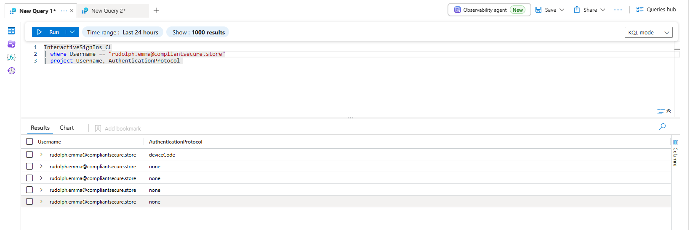
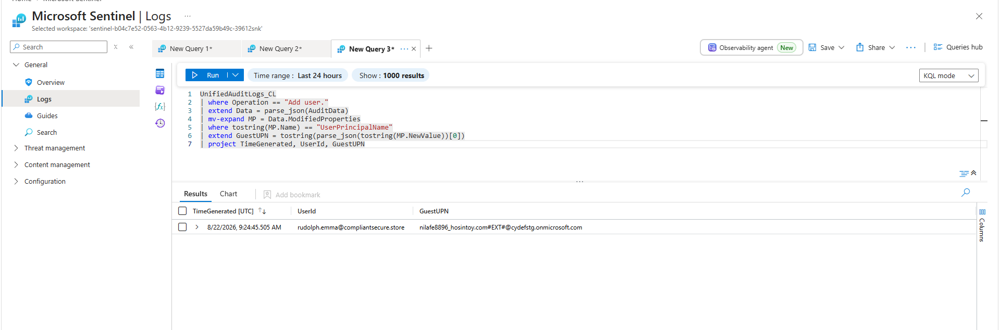
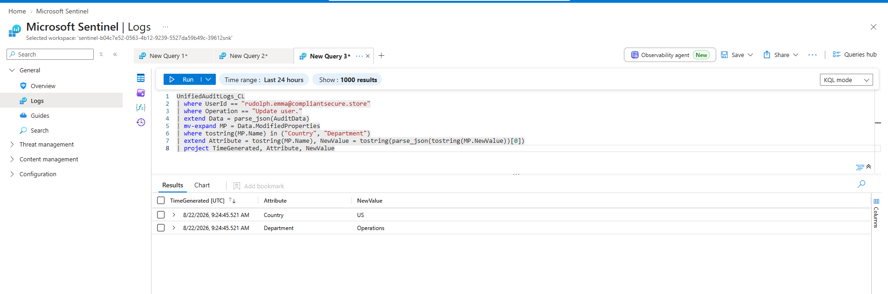
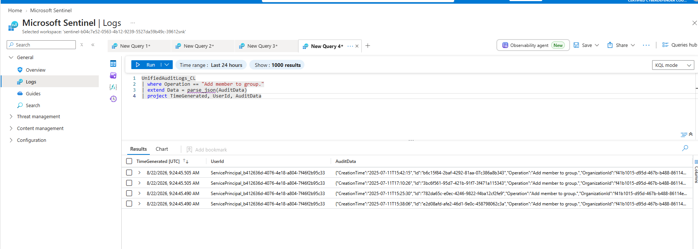

# Entra ID Guest Privilege Escalation via Dynamic Group Membership Abuse

**Type:** Identity & Access Investigation
**Platform:** Microsoft Sentinel (KQL)
**Log Sources:** MTSummaryMessage_CL, InteractiveSignIns_CL, UnifiedAuditLogs_CL

## Summary

A phishing email led to a device-code authentication compromise. The attacker used the resulting access to create a guest account, then modified two attributes on it — `Country` and `Department` — matching the membership rule of a dynamic group called `Operations`. 58 seconds later, the guest was added to the group automatically by the dynamic-group engine, not a human. The attacker never touched the group directly; they shaped the guest's attributes until the engine did it for them.

## Scope

- Tenant: `cydefstg.onmicrosoft.com`
- Compromised account: `rudolph.emma@compliantsecure.store`
- Guest created: `nilafe8896_hosintoy.com#EXT#@cydefstg.onmicrosoft.com`
- Group affected: `Operations`
- Tables queried: `MTSummaryMessage_CL`, `InteractiveSignIns_CL`, `UnifiedAuditLogs_CL`

## Attack Chain

```
Phishing email ("Security code")
        |
Device-code authentication (victim completes attacker's session)
        |
Compromised user session
        |
Guest account created (Add user.)
        |
Guest attributes modified — Country, Department (Update user.)
        |
Dynamic group rule evaluated and satisfied
        |
Guest added to Operations (Add member to group.)
        |
Group permissions inherited — privilege escalation
```

## Timeline

| Time (UTC)          | Operation             | Notes                                              |
|----------------------|------------------------|-----------------------------------------------------|
| 2025-07-11 16:48:19 | Phishing email delivered | Subject: "Security code"                          |
| 2025-07-11 16:50:19 | Device-code sign-in     | Victim completes attacker-initiated auth flow       |
| 2025-07-11 16:56:53 | Add user.               | Guest account created                               |
| 2025-07-11 17:09:28 | Update user.            | Country and Department modified                     |
| 2025-07-11 17:10:26 | Add member to group.    | Guest added to Operations, 58s after attribute change |

## Investigation

**Phishing email delivery.** Message trace confirms delivery of the lure at 16:48:19, subject "Security code," from `185.159.157.42`.

```kql
MTSummaryMessage_CL
| where RecipientStatus == "rudolph.emma@compliantsecure.store##Deliver"
| project OriginalClientIp, OriginTimestampUtc, MessageSubject
```



**Device-code sign-in.** Filtering `InteractiveSignIns_CL` on the account shows one entry with `AuthenticationProtocol = deviceCode`, confirming the victim completed the attacker-initiated device-code flow.

```kql
InteractiveSignIns_CL
| where Username == "rudolph.emma@compliantsecure.store"
| project Username, AuthenticationProtocol
```



**Guest account created.** `Add user.` at 16:56:53. The UPN is nested inside `ModifiedProperties`, so pulling it out needs `parse_json()` → `mv-expand` → `tostring()`.

```kql
UnifiedAuditLogs_CL
| where Operation == "Add user."
| extend Data = parse_json(AuditData)
| mv-expand MP = Data.ModifiedProperties
| where tostring(MP.Name) == "UserPrincipalName"
| extend GuestUPN = tostring(parse_json(tostring(MP.NewValue))[0])
| project TimeGenerated, UserId, GuestUPN
```



**Attribute manipulation.** `Update user.` at 17:09:28 sets `Country = US`, `Department = Operations` — the exact fields the dynamic group's rule checks.

```kql
UnifiedAuditLogs_CL
| where UserId == "rudolph.emma@compliantsecure.store"
| where Operation == "Update user."
| extend Data = parse_json(AuditData)
| mv-expand MP = Data.ModifiedProperties
| where tostring(MP.Name) in ("Country", "Department")
| extend Attribute = tostring(MP.Name), NewValue = tostring(parse_json(tostring(MP.NewValue))[0])
| project TimeGenerated, Attribute, NewValue
```



**Dynamic group membership.** `Add member to group.` fires 58 seconds later, targeting `Operations`. The actor is `ServicePrincipal_b412636d-4076-4e18-a804-7f46f2b95c33`, confirming this was the dynamic-group engine, not a manual action.

```kql
UnifiedAuditLogs_CL
| where Operation == "Add member to group."
| extend Data = parse_json(AuditData)
| project TimeGenerated, UserId, AuditData
```



## Root Cause & Impact

`Operations` was a dynamic group keyed off `Country`/`Department` — attributes writable by anyone with user-management rights, including on guests. Once the attacker could create and edit users, group membership was reachable without touching the group object itself. The guest inherited whatever access `Operations` carried.

## Recommendations

- Alert on attribute updates to fields referenced by active dynamic-group rules.
- Alert on attribute update → group membership change on the same object within minutes.
- Exclude guests from dynamic-group rules that grant meaningful access.
- Gate device-code auth behind Conditional Access, or disable if unused.

## Indicators

| Type               | Value                                                                 |
|--------------------|------------------------------------------------------------------------|
| Phishing origin IP | 185.159.157.42                                                          |
| Compromised UPN    | rudolph.emma@compliantsecure.store                                     |
| Guest UPN          | nilafe8896_hosintoy.com#EXT#@cydefstg.onmicrosoft.com                  |
| Target group       | Operations                                                              |
| Service Principal  | b412636d-4076-4e18-a804-7f46f2b95c33 (Microsoft Approval Management)   |
